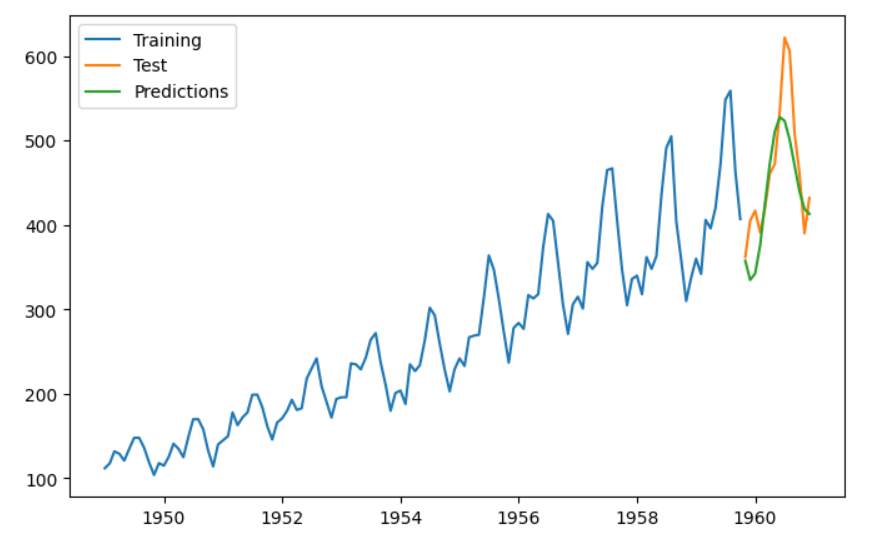

# Time Series Forecasting with ARIMA: Air Passengers Dataset ✈️

This project provides a complete, end-to-end workflow for time series analysis and forecasting using the classic "Air Passengers" dataset. The goal is to predict the number of monthly airline passengers using a SARIMA (Seasonal Autoregressive Integrated Moving Average) model.

The entire process is contained within a Google Colab Notebook (`.ipynb`), demonstrating data loading, exploratory data analysis, time series decomposition, model training, and evaluation in an interactive environment.

---

### ✨ Key Features

*   **📈 Exploratory Data Analysis (EDA):** Visualization of trends and seasonality.
*   **🧩 Time Series Decomposition:** Separation of the series into trend, seasonal, and residual components.
*   **🤖 Automated Model Selection:** Use of `auto_arima` to find the optimal SARIMA model parameters.
*   **📊 Model Evaluation:** Splitting data into training and testing sets to validate forecast accuracy with RMSE and MAE metrics.
*   **🖼️ Clear Visualizations:** Generation of plots for analysis and results using Matplotlib.

---

### 🛠️ Technologies Used

*   **Google Colab / Jupyter Notebook**
*   **Python 3.x**
*   **Pandas:** For data manipulation and analysis.
*   **NumPy:** For numerical operations.
*   **Matplotlib:** For data visualization.
*   **Statsmodels:** For time series decomposition.
*   **Pmdarima:** For the `auto_arima` function.
*   **Scikit-learn:** For calculating evaluation metrics.

---

### 🚀 How to Run this Project in Google Colab

You can run this project directly in your browser with Google Colab.

1.  **Open the Notebook in Colab:**

    Click the button below to open the notebook directly from this repository in Google Colab.

    

2.  **Run the Setup Cell:**

    💡 The very first code cell in the notebook is a setup cell. It will:
    *   Install all the required Python libraries.
    *   Automatically download the `AirPassengers.csv` dataset from the this repository.

3.  **Execute the Analysis:**

    After the setup cell completes, you can run the rest of the notebook to perform the analysis.
    *   Execute each cell sequentially by pressing `Shift + Enter`.
    *   Or, run the entire notebook at once by selecting **`Runtime` -> `Run all`** from the menu.

---

### 📊 Results

The `auto_arima` model successfully captures the trend and seasonality of the data. The final plot shows the model's predictions on the test set against the actual values.

**Model Performance on Test Set:**
*   **RMSE (Root Mean Squared Error):** 20.28
*   **MAE (Mean Absolute Error):** 14.77

> **Note:** These values were generated during the last run. You can run the notebook yourself to reproduce them!

---

### 🌱 Future Improvements

*   **Try other models:** Implement other forecasting models like Prophet or an LSTM neural network for comparison.
*   **Cross-validation:** Use time series cross-validation for more robust model evaluation.
*   **Exogenous variables:** Incorporate external factors (e.g., economic indicators) that might influence air travel.
